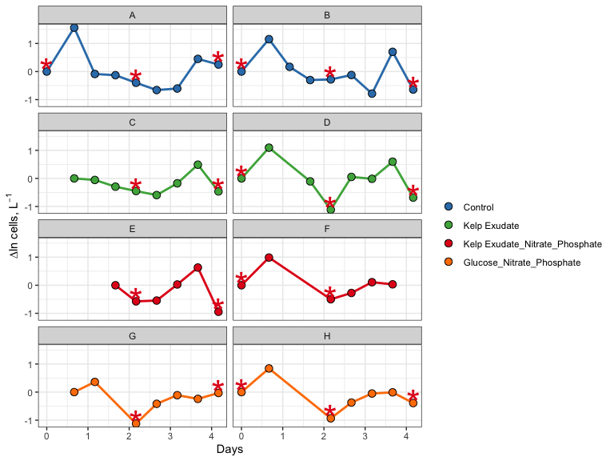
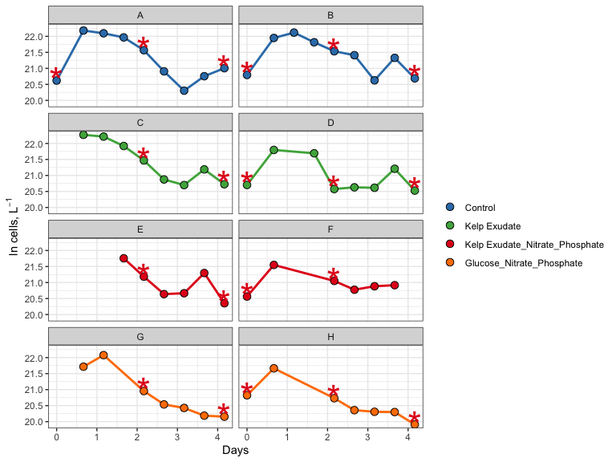

211020\_2021\_abundance\_data
================
Alessandra Valdivia
10/20/2021

# Objective

In this document, bacterial abundance data from **individual bottles**
in the 2021 Microbial DOC Remineralization Bioassay is processed, QC’d,
and analyzed. This experiment includes four treatments (1) Control (2)
Addition of Kelp Exudate (3) Addition of Kelp Exudate, Nitrate,
Phosphate (4) Addition of Glucose, Nitrate, and Phosphate with two
bottles for each treatment. The purpose of this experiment was to see
how different treatments affect the bacterial populations.

First Step: load packages necessary to analyze our data

``` r
library(tidyverse)
library(readxl)
library(lubridate)
```

# Import Data

``` r
excel_sheets("~/Documents/EEMB 144 + 144L/git-related business/144l_students_2021/Input_Data/144L_2021_BactAbund.xlsx")
```

    ## [1] "Metadata" "Data"

``` r
metadata <- read_excel("~/Documents/EEMB 144 + 144L/git-related business/144l_students_2021/Input_Data/144L_2021_BactAbund.xlsx", sheet = "Metadata")
glimpse(metadata)
```

    ## Rows: 80
    ## Columns: 16
    ## $ Experiment           <chr> "144L_2021", "144L_2021", "144L_2021", "144L_2021…
    ## $ Location             <chr> "Goleta Pier", "Goleta Pier", "Goleta Pier", "Gol…
    ## $ Temperature          <dbl> 19, 19, 19, 19, 19, 19, 19, 19, 19, 19, 19, 19, 1…
    ## $ Depth                <dbl> 1, 1, 1, 1, 1, 1, 1, 1, 1, 1, 1, 1, 1, 1, 1, 1, 1…
    ## $ Bottle               <chr> "A", "A", "A", "A", "A", "A", "A", "A", "A", "A",…
    ## $ Timepoint            <dbl> 0, 1, 2, 3, 4, 5, 6, 7, 8, 9, 0, 1, 2, 3, 4, 5, 6…
    ## $ Treatment            <chr> "Control", "Control", "Control", "Control", "Cont…
    ## $ Target_DOC_Amendment <dbl> 0, 0, 0, 0, 0, 0, 0, 0, 0, 0, 0, 0, 0, 0, 0, 0, 0…
    ## $ Inoculum_L           <dbl> 2, 2, 2, 2, 2, 2, 2, 2, 2, 2, 2, 2, 2, 2, 2, 2, 2…
    ## $ Media_L              <dbl> 5, 5, 5, 5, 5, 5, 5, 5, 5, 5, 5, 5, 5, 5, 5, 5, 5…
    ## $ Datetime             <chr> "2021-10-04T16:00", "2021-10-05T08:00", "2021-10-…
    ## $ TOC_Sample           <lgl> TRUE, FALSE, FALSE, FALSE, TRUE, FALSE, FALSE, FA…
    ## $ Cell_Sample          <lgl> TRUE, TRUE, TRUE, TRUE, TRUE, TRUE, TRUE, TRUE, T…
    ## $ DAPI_Sample          <lgl> TRUE, FALSE, FALSE, FALSE, TRUE, FALSE, FALSE, FA…
    ## $ DNA_Sample           <lgl> TRUE, FALSE, FALSE, FALSE, TRUE, FALSE, FALSE, FA…
    ## $ Nutrient_Sample      <lgl> TRUE, FALSE, FALSE, FALSE, FALSE, FALSE, FALSE, F…

``` r
data <- read_excel("~/Documents/EEMB 144 + 144L/git-related business/144l_students_2021/Input_Data/144L_2021_BactAbund.xlsx", sheet = "Data")
glimpse(data)
```

    ## Rows: 72
    ## Columns: 5
    ## $ Bottle       <chr> "A", "A", "A", "A", "A", "A", "A", "A", "A", "B", "B", "B…
    ## $ Timepoint    <dbl> 0, 1, 2, 3, 4, 5, 6, 7, 8, 0, 1, 2, 3, 4, 5, 6, 7, 8, 0, …
    ## $ all_cells_uL <chr> "901.48904752420799", "4302.9300548457404", "3944.9457004…
    ## $ LNA_cells_uL <chr> "653.047184033284", "768.27893058466896", "937.2441189022…
    ## $ HNA_cells_uL <chr> "248.441863490923", "3534.65112426107", "3007.70158156820…

``` r
joined <- left_join(metadata, data) #attach data to metadata
```

    ## Joining, by = c("Bottle", "Timepoint")

``` r
#joins right dataset to the left one by using variables that are the same across dataframes
glimpse(joined)
```

    ## Rows: 80
    ## Columns: 19
    ## $ Experiment           <chr> "144L_2021", "144L_2021", "144L_2021", "144L_2021…
    ## $ Location             <chr> "Goleta Pier", "Goleta Pier", "Goleta Pier", "Gol…
    ## $ Temperature          <dbl> 19, 19, 19, 19, 19, 19, 19, 19, 19, 19, 19, 19, 1…
    ## $ Depth                <dbl> 1, 1, 1, 1, 1, 1, 1, 1, 1, 1, 1, 1, 1, 1, 1, 1, 1…
    ## $ Bottle               <chr> "A", "A", "A", "A", "A", "A", "A", "A", "A", "A",…
    ## $ Timepoint            <dbl> 0, 1, 2, 3, 4, 5, 6, 7, 8, 9, 0, 1, 2, 3, 4, 5, 6…
    ## $ Treatment            <chr> "Control", "Control", "Control", "Control", "Cont…
    ## $ Target_DOC_Amendment <dbl> 0, 0, 0, 0, 0, 0, 0, 0, 0, 0, 0, 0, 0, 0, 0, 0, 0…
    ## $ Inoculum_L           <dbl> 2, 2, 2, 2, 2, 2, 2, 2, 2, 2, 2, 2, 2, 2, 2, 2, 2…
    ## $ Media_L              <dbl> 5, 5, 5, 5, 5, 5, 5, 5, 5, 5, 5, 5, 5, 5, 5, 5, 5…
    ## $ Datetime             <chr> "2021-10-04T16:00", "2021-10-05T08:00", "2021-10-…
    ## $ TOC_Sample           <lgl> TRUE, FALSE, FALSE, FALSE, TRUE, FALSE, FALSE, FA…
    ## $ Cell_Sample          <lgl> TRUE, TRUE, TRUE, TRUE, TRUE, TRUE, TRUE, TRUE, T…
    ## $ DAPI_Sample          <lgl> TRUE, FALSE, FALSE, FALSE, TRUE, FALSE, FALSE, FA…
    ## $ DNA_Sample           <lgl> TRUE, FALSE, FALSE, FALSE, TRUE, FALSE, FALSE, FA…
    ## $ Nutrient_Sample      <lgl> TRUE, FALSE, FALSE, FALSE, FALSE, FALSE, FALSE, F…
    ## $ all_cells_uL         <chr> "901.48904752420799", "4302.9300548457404", "3944…
    ## $ LNA_cells_uL         <chr> "653.047184033284", "768.27893058466896", "937.24…
    ## $ HNA_cells_uL         <chr> "248.441863490923", "3534.65112426107", "3007.701…

# Prepare Data

We must convert the Date and Time column values from characters to
dates, add columns with time elapsed for each treatment, and convert to
cells/L because it will help match up with the TOC data later. We will
then subset the data for the variables of interest and drop NA values.

``` r
cells <- joined %>%
  mutate(Datetime = ymd_hm(Datetime), #splits apart Datetime as specified
  cells_L = as.numeric(all_cells_uL) * 1000000) %>% #converts cells per microliter into cells per liter
  group_by(Treatment, Bottle) %>%
#group our dataset so that we can calculate the time elapsed properly
  mutate(interv = interval(first(Datetime), Datetime),
         s = as.numeric(interv),
         hours = s/3600,
         days = hours/24) %>%
  ungroup () %>%
  select(Experiment:DNA_Sample, cells_L, hours, days) %>%
  drop_na(cells_L)
```

    ## Warning in mask$eval_all_mutate(quo): NAs introduced by coercion

``` r
glimpse(cells)
```

    ## Rows: 60
    ## Columns: 18
    ## $ Experiment           <chr> "144L_2021", "144L_2021", "144L_2021", "144L_2021…
    ## $ Location             <chr> "Goleta Pier", "Goleta Pier", "Goleta Pier", "Gol…
    ## $ Temperature          <dbl> 19, 19, 19, 19, 19, 19, 19, 19, 19, 19, 19, 19, 1…
    ## $ Depth                <dbl> 1, 1, 1, 1, 1, 1, 1, 1, 1, 1, 1, 1, 1, 1, 1, 1, 1…
    ## $ Bottle               <chr> "A", "A", "A", "A", "A", "A", "A", "A", "A", "B",…
    ## $ Timepoint            <dbl> 0, 1, 2, 3, 4, 5, 6, 7, 8, 0, 1, 2, 3, 4, 5, 6, 7…
    ## $ Treatment            <chr> "Control", "Control", "Control", "Control", "Cont…
    ## $ Target_DOC_Amendment <dbl> 0, 0, 0, 0, 0, 0, 0, 0, 0, 0, 0, 0, 0, 0, 0, 0, 0…
    ## $ Inoculum_L           <dbl> 2, 2, 2, 2, 2, 2, 2, 2, 2, 2, 2, 2, 2, 2, 2, 2, 2…
    ## $ Media_L              <dbl> 5, 5, 5, 5, 5, 5, 5, 5, 5, 5, 5, 5, 5, 5, 5, 5, 5…
    ## $ Datetime             <dttm> 2021-10-04 16:00:00, 2021-10-05 08:00:00, 2021-1…
    ## $ TOC_Sample           <lgl> TRUE, FALSE, FALSE, FALSE, TRUE, FALSE, FALSE, FA…
    ## $ Cell_Sample          <lgl> TRUE, TRUE, TRUE, TRUE, TRUE, TRUE, TRUE, TRUE, T…
    ## $ DAPI_Sample          <lgl> TRUE, FALSE, FALSE, FALSE, TRUE, FALSE, FALSE, FA…
    ## $ DNA_Sample           <lgl> TRUE, FALSE, FALSE, FALSE, TRUE, FALSE, FALSE, FA…
    ## $ cells_L              <dbl> 901489048, 4302930055, 3944945700, 3467546844, 23…
    ## $ hours                <dbl> 0, 16, 28, 40, 52, 64, 76, 88, 100, 0, 16, 28, 40…
    ## $ days                 <dbl> 0.0000000, 0.6666667, 1.1666667, 1.6666667, 2.166…

# Plot Growth Curves

Now, we will plot growth curves for each bottle. We need cell abundance
and days data.

First, let’s set some aesthetics for our plot. Then we’ll use ggplot to
visualize the data.

``` r
#assign hex colors to our different treatments
custom.colors <- c("Control" = "#337EB8", "Kelp Exudate" = "#4DAF4A", "Kelp Exudate_Nitrate_Phosphate" = "#E41A1C", "Glucose_Nitrate_Phosphate" = "#FF7F00")

#assign levels to control what order things appear in the legend
levels <- c("Control", "Kelp Exudate", "Kelp Exudate_Nitrate_Phosphate", "Glucose_Nitrate_Phosphate")

#now we'll use ggplot to visualize the data.

cells %>%
  mutate(dna = ifelse(DNA_Sample == T, "*", NA)) %>%
  ggplot(aes(x=days, y=cells_L, group = interaction(Treatment,Bottle))) +
  geom_line(aes(color = factor(Treatment, levels = levels)), size = 1) +
  geom_point(aes(fill = factor(Treatment, levels = levels)), size = 3, color = "black", shape = 21) +
  geom_text(aes(label = dna), size = 12, color = "#E41A1C") +
  labs(x = "Days", y = expression(paste("Cells, L"^-1)), fill = "") +
  guides (color = "none") + 
  scale_color_manual(values = custom.colors) + 
  scale_fill_manual(values = custom.colors) + 
  theme_bw()
```

    ## Warning: Removed 40 rows containing missing values (geom_text).

<!-- -->

# Next Steps

We can calculate:

-   total change in cells from initial conditions to the end of the
    experiment,
-   specific growth rate as the slope of ln(abundance) vs time during
    exponential growth phase,
-   doubling time as ln(2) divided by the specific growth rate,
-   and mean of each of these parameters across each treatment.

First, we need to determine **where** exponential growth is occurring in
each of our bottles, if it does. To do this, we’ll plot ln(abundance) vs
time.

# Identify exponential phase of growth in our remin experiments

``` r
ln_cells <- cells %>%
  group_by(Treatment, Bottle) %>%
  mutate(ln_cells = log(cells_L), #note that log(x) gives the natural log of x
         diff_ln_cells = ln_cells - lag(ln_cells, default = first(ln_cells)))
```

## Plot newly calculated data!

``` r
ln_cells %>%
  mutate(dna = ifelse(DNA_Sample == T, "*", NA)) %>%
  ggplot(aes(x=days, y=diff_ln_cells, group = interaction(Treatment,Bottle))) + 
  geom_line(aes(color = factor(Treatment, levels = levels)), size = 1) +
  geom_point(aes(fill = factor(Treatment, levels = levels)), size = 3, color = "black", shape = 21) +
  geom_text(aes(label = dna), size = 12, color = "#E41A1C") +
  labs(x = "Days", y = expression(paste("∆ln cells, L"^-1)), fill = "") +
  guides(color = "none") +
  scale_color_manual(values = custom.colors) + 
  scale_fill_manual(values = custom.colors) +
  facet_wrap("Bottle", ncol =2) +
  theme_bw() 
```

    ## Warning: Removed 40 rows containing missing values (geom_text).

<!-- -->

Exponential growth seems to be occurring right at the beginning of the
experiment between 0-1 days for most of the bottles.

We will try plotting ln\_cells to see if that can help us identify
exponential growth in the control a little better.

``` r
ln_cells %>%
  mutate(dna = ifelse(DNA_Sample == T, "*", NA)) %>%
  ggplot(aes(x=days, y=ln_cells, group = interaction(Treatment,Bottle))) + 
  geom_line(aes(color = factor(Treatment, levels = levels)), size = 1) +
  geom_point(aes(fill = factor(Treatment, levels = levels)), size = 3, color = "black", shape = 21) +
  geom_text(aes(label = dna), size = 12, color = "#E41A1C") +
  labs(x = "Days", y = expression(paste("ln cells, L"^-1)), fill = "") +
  guides(color = "none") +
  scale_color_manual(values = custom.colors) + 
  scale_fill_manual(values = custom.colors) +
  facet_wrap("Bottle", ncol =2) +
  theme_bw()
```

    ## Warning: Removed 40 rows containing missing values (geom_text).

<!-- -->

# Summary

In this document, we were able to plot growth curves for each of the
different treatments and individual bottles. Using these plots and data,
we were able to identify the regions in which exponential growth is
occurring. Based on the plots above, exponential growth occurs within
the first day of the treatment. Some data points are missing due to the
sticker labels falling off of the cryovials in the liquid nitrogen. To
account for this error, flow cytometry will be run again.
